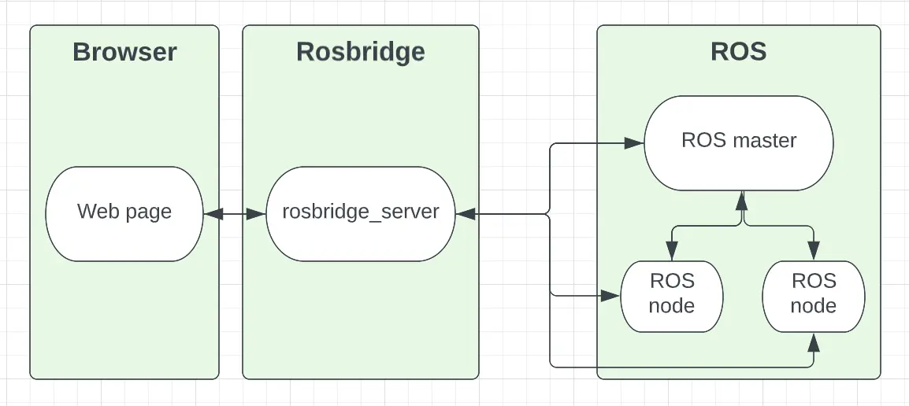

# Rosbridge Demo with ROS 1 and ROS 2

Check out the hosted demo at [foxglove.github.io/rosbridge-demo/](https://foxglove.github.io/rosbridge-demo/).

Follow along with the whole tutorial at [Using Rosbridge with ROS 1 and ROS 2](https://foxglove.dev/blog/using-rosbridge-with-ros1-and-ros2).

